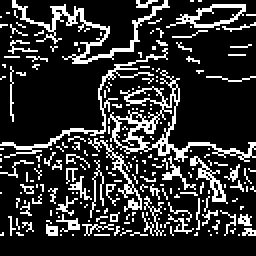
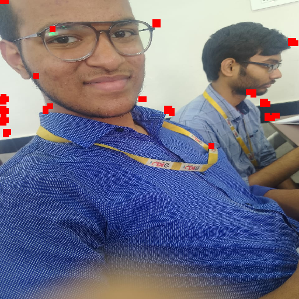

# FPGA Image Processing Pipeline

A fully pipelined, synthesizable FPGA image processing system implemented in Verilog, capable of performing **Canny Edge Detection** and **Harris Corner Detection** on real images. Simulated using Icarus Verilog and GTKWave.

---

## 📸 Results

| Input | Canny Edge Detection | Harris Corners |
|---|---|---|
|  |  |  |

---

## 🏗️ Pipeline Architecture

```
RGB Input
    │
    ▼
┌─────────────┐
│  Grayscale  │  RGB → Y  (1 clock)
└──────┬──────┘
       │
       ├──────────────────────────────────────┐
       │                                      │
       ▼                                      ▼
 [Canny Pipeline]                    [Harris Pipeline]
       │                                      │
       ▼                                      ▼
┌─────────────┐                     ┌─────────────────┐
│ 5×5 Gaussian│                     │  Sobel Gx,Gy    │
│    Blur     │                     │  per pixel      │
└──────┬──────┘                     └────────┬────────┘
       ▼                                     ▼
┌─────────────┐                     ┌─────────────────┐
│Sobel+Directn│                     │ Sum Gx²,Gy²,    │
│  Gx,Gy,θ   │                     │ GxGy over 3×3   │
└──────┬──────┘                     └────────┬────────┘
       ▼                                     ▼
┌─────────────┐                     ┌─────────────────┐
│    NMS      │                     │  Harris R =     │
│ (thin edges)│                     │  det - k·trace² │
└──────┬──────┘                     └────────┬────────┘
       ▼                                     ▼
┌─────────────┐                        Corner Map
│ Hysteresis  │                      (red dots on
│ Thresholding│                       real image)
└──────┬──────┘
       ▼
   Edge Map
```

---

## 📁 Project Structure

```
FPGA/
│
├── src/
│   ├── grayscale.v          # RGB to grayscale (Y = 0.299R + 0.587G + 0.114B)
│   ├── line_buffer.v        # Core 3×3 sliding window primitive
│   ├── gaussian_blur.v      # 3×3 Gaussian smoothing kernel
│   ├── gaussian5x5.v        # 5×5 Gaussian smoothing kernel
│   ├── sobel.v              # Sobel edge magnitude
│   ├── sobel_dir.v          # Sobel with gradient direction (4 angles)
│   ├── nms.v                # Non-Maximum Suppression
│   ├── hysteresis.v         # Double threshold hysteresis
│   ├── canny_pipeline.v     # Full Canny edge detection pipeline
│   ├── harris.v             # 2-stage Harris corner detector
│   └── harris_pipeline.v    # Full Harris corner detection pipeline
│
├── tb/
│   ├── tb_grayscale.v       # Grayscale testbench
│   ├── tb_line_buffer.v     # Line buffer testbench
│   ├── tb_sobel.v           # Sobel testbench
│   ├── tb_gaussian_blur.v   # Gaussian blur testbench
│   ├── tb_image_pipeline.v  # Full pipeline testbench
│   ├── tb_canny.v           # Canny testbench with real image
│   └── tb_harris.v          # Harris testbench with real image
│
├── scripts/
│   ├── img_to_hex.py        # Convert PNG/JPG to hex for simulation
│   └── hex_to_img.py        # Convert simulation output back to image
│
├── sim/                     # Simulation outputs (VCD, hex files)
└── docs/                    # Result images for README
```

---

## 🔧 Modules

### Core Primitive
| Module | Description |
|---|---|
| `line_buffer.v` | Parameterized N-bit wide shift-register based line buffer. Feeds a 3×3 sliding window to all filter stages. |

### Canny Edge Detection Pipeline
| Module | Description |
|---|---|
| `grayscale.v` | Converts 24-bit RGB to 8-bit grayscale using fixed-point coefficients |
| `gaussian5x5.v` | 5×5 Gaussian blur using kernel weights `[2,4,5,4,2; 4,9,12,9,4; ...]÷159` |
| `sobel_dir.v` | Computes gradient magnitude and quantized direction (0°/45°/90°/135°) |
| `nms.v` | Non-maximum suppression — thins edges to 1 pixel wide |
| `hysteresis.v` | Double-threshold hysteresis linking strong and weak edges |
| `canny_pipeline.v` | Top-level Canny chain |

### Harris Corner Detection Pipeline
| Module | Description |
|---|---|
| `harris.v` | Two-stage: (1) Sobel → Gx², Gy², GxGy per pixel; (2) Sum over 3×3 → R = det(M) - k·trace(M)² |
| `harris_pipeline.v` | Grayscale → Harris chain |

---

## 🚀 Getting Started

### Prerequisites

- [Icarus Verilog](https://bleyer.org/icarus/) — simulation
- [GTKWave](http://gtkwave.sourceforge.net/) — waveform viewer
- Python 3 + Pillow — image conversion

```bash
# Linux
sudo apt install iverilog gtkwave
pip install pillow

# Windows — download Icarus from https://bleyer.org/icarus/
pip install pillow
```

---

### Running Canny Edge Detection

**Step 1 — Convert your image:**
```bash
# Edit IMG_W, IMG_H in img_to_hex.py (default 128×128)
python scripts/img_to_hex.py
```

**Step 2 — Simulate:**
```bash
iverilog -o sim/sim.vvp tb/tb_canny.v src/canny_pipeline.v src/gaussian5x5.v \
         src/sobel_dir.v src/nms.v src/hysteresis.v src/grayscale.v src/line_buffer.v
vvp sim/sim.vvp
```

**Step 3 — Visualize:**
```bash
python scripts/hex_to_img.py
```

---

### Running Harris Corner Detection

```bash
iverilog -o sim/sim.vvp tb/tb_harris.v src/harris_pipeline.v src/harris.v \
         src/grayscale.v src/line_buffer.v
vvp sim/sim.vvp
python scripts/hex_to_img.py
```

---

### Viewing Waveforms

```bash
gtkwave sim/dump.vcd
```

---

## ⚙️ Parameters

### Canny Pipeline (`tb_canny.v`)
| Parameter | Default | Description |
|---|---|---|
| `IMG_W` | 128 | Image width in pixels |
| `IMG_H` | 128 | Image height in pixels |
| `HIGH_THR` | 40 | Strong edge threshold |
| `LOW_THR` | 15 | Weak edge threshold |

**Threshold guide:**
```
Resolution    HIGH / LOW
32×32    →   150  / 60
64×64    →   80   / 30
128×128  →   40   / 15   ← recommended
```

### Harris Pipeline (`tb_harris.v`)
| Parameter | Default | Description |
|---|---|---|
| `IMG_W` | 128 | Image width in pixels |
| `THRESHOLD` | 50000 | Corner response threshold |

---

## 📊 Pipeline Latency

```
Stage             Latency
─────────────────────────────
Grayscale         1 clock
Gaussian 5×5      ~5 rows
Sobel + Direction ~2 rows
NMS               ~2 rows
Hysteresis        ~2 rows
Harris (2-stage)  ~4 rows
─────────────────────────────
Total Canny       ~11 rows
Total Harris      ~7 rows
```

---

## 🧪 Test Results

Tested on real photographs at 128×128 resolution:

**Canny Edge Detection (HIGH_THR=40, LOW_THR=15):**
- Clean edge outlines of faces, glasses frames, clothing
- No horizontal stripe artifacts (eliminated by 5×5 Gaussian)
- Thin 1-pixel-wide edges after NMS

**Harris Corner Detection (THRESHOLD=50000):**
- 62 corners detected on test image
- Accurate placement on glasses frames, lanyard intersections, face boundary
- Suitable for feature matching and object tracking applications

---

## 💡 Design Notes

- All arithmetic uses **fixed-point** (no floating point)
- `line_buffer.v` is parameterized by both pixel width and image width — reused across all stages
- Harris detector uses **two line buffers**: one for Sobel, one for summing gradient products over a 3×3 window
- Gaussian 5×5 uses the standard approximation kernel (weights sum to 159)
- Pipeline is **fully synthesizable** — ready for Vivado/Quartus targeting Basys3/Artix-7

---

## 📚 References

- Canny, J. (1986). *A Computational Approach to Edge Detection*
- Harris, C. & Stephens, M. (1988). *A Combined Corner and Edge Detector*
- Xilinx UG901 — Vivado Design Suite User Guide

---

## 🛠️ Future Work

- [ ] Deploy on Basys3 / Arty Z7 with HDMI output
- [ ] 5×5 Harris window for better corner localization  
- [ ] Optical flow (Lucas-Kanade) using Harris corners
- [ ] Quantized CNN inference layer
- [ ] AXI-Stream interface for SoC integration

---

## 👤 Author

Built as part of an FPGA digital design learning project.  
Pipeline designed and verified using Icarus Verilog + GTKWave.

